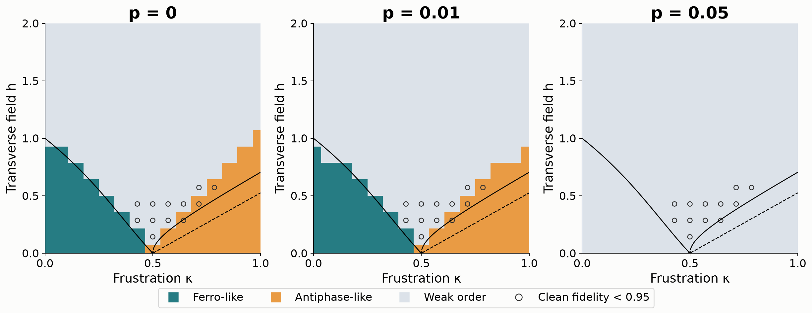

# PhaseGuard

**A quantum phase map must pass a circuit test.**

This project maps the 1D ANNNI model. It separates finite-size physics from errors in state preparation and phase detection.

**Main result:** the 28-CNOT circuit retains **67 of 70** ordered labels at 1% gate noise. Its clean labels agree with exact results at 221 of 225 points. Uncertain state preparations are marked.

Read the [three-page report](report.pdf), open the [executed notebook](PhaseGuard.ipynb), view the [presentation slides](presentation-reviewed.pptx), or download the [complete source package](scientific-source.zip).



## Start here

1. Open `PhaseGuard.ipynb`. All analysis cells use saved results and can run without a long simulation.
2. Read `report.md` or the supplied PDF.
3. Inspect the main maps: `figures/vqe_phase_p0.00.png`, `figures/vqe_phase_p0.01.png`, and `figures/vqe_phase_p0.05.png`.
4. Use `data/variational_summary.json` for the main numeric results. `data/summary.json` records the exact-loader comparison.

## Main experiments

- Clean map: N = 12, 41 × 41 points, periodic chain, exact even-symmetry ground states.
- Main noisy map: N = 8, 15 × 15 points. A four-layer VQE preparation has 28 CNOTs. Add a target depolarizing channel after **every** CNOT. Keep the clean parameters fixed under noise.
- Comparison map: N = 8, 21 × 21 points. Compile each ground state with PennyLane Möttönen preparation, which has 254 CNOTs. Apply the same gate-noise convention.
- Noise: p = 0, 0.01, 0.05. The one-qubit gates and final Z measurements are ideal.
- Independent method: fidelity susceptibility at N = 8, 12, 16.
- Mitigation: linear zero-noise extrapolation from p and 2p. This is a numerical test with known noise strength.
- Additional control: six-start variational optimization at three points in `variational_control/`.
- Optional readout study: a separate ideal-state experiment shows why direct Z measurement is better than a routed parity circuit here.

The noisy maps show detected order after a noisy circuit. They do not show a new equilibrium phase diagram. A weak signal cannot prove a paramagnetic ground state. We do not claim that N ≤ 16 proves the floating phase.

## Reproduce

Python 3.14.7 and PennyLane 0.44.1 were used. See `environment.json` for all measured package versions. Create a fresh environment and install `requirements.txt`.

```sh
python phaseguard.py validate
python phaseguard.py scan
python phaseguard.py cuts
python noisy_preparation.py validate
python noisy_preparation.py scan
python noisy_preparation.py scan --mitigate
python preparation_control.py
python variational_control/run_control.py --symmetry-weight 0.5 --output symmetry_results.json --iterations 1200
python variational_control/compare_preparation.py
python variational_map/run_map.py
python variational_map/refine_map.py
python variational_map/audit_map.py
python finite_shots.py
python analyze.py
python analyze_variational.py
python build_notebook.py
python audit.py
```

The exact-loader maps take several minutes on the test computer. The full VQE map took about ten minutes. Use one numerical thread per process for similar run times. A small loader check can use `python noisy_preparation.py scan --points 5`. This replaces the saved full loader map; use a copy of the project for a small check.

`phaseguard.py` contains the sparse Hamiltonian and clean methods. `noisy_preparation.py` applies the PennyLane gate list with exact density matrices. The fast simulator uses real amplitudes and rejects unsupported complex gates. Tests compare it with `default.mixed` and an independent matrix calculation. No approximate noise formula is used for the main preparation maps.

## Data and checks

`data/` and `variational_map/` contain arrays, scalar results, parameters, and test records. `figures/` contains figures made from those arrays. The main maps use exact expectation values. `data/finite_shots.json` gives a separate sampling test. No QPU result is claimed. VQE has a measured preparation error even at p = 0. The clean state is not silently inserted in the noisy preparation circuits.

At h = 0, the selected state is the equal positive superposition of all basis ground states. At κ = 0.5, h = 0, there are many ground states. That point is not used to establish a unique phase. Finite-size phase labels use a stated order threshold. The appendix checks other thresholds.

## Sources and credit

- Challenge: https://github.com/benmcdonough20/QSITE-2026-QuantumCoalition
- PennyLane ANNNI demo: https://pennylane.ai/demos/tutorial_annni
- PennyLane noise challenge: https://pennylane.ai/challenges/heisenberg_model
- Cea et al., ANNNI finite-size and floating-phase study: https://arxiv.org/abs/2402.11022
- PennyLane Möttönen state preparation: https://docs.pennylane.ai/en/stable/code/api/pennylane.MottonenStatePreparation.html
- Temme et al., error mitigation for short-depth quantum circuits: https://arxiv.org/abs/1612.02058

The challenge gives the Hamiltonian, reference curves, and noise convention. This project adds the symmetry-sector solver, gate-level noise maps, tests, finite-size comparisons, and analysis. We correct two reference details: hI(0) = 1; the lower antiphase–floating line is PT, while the upper line is KT/BKT.

## AI-use disclosure

This project was made with substantial AI assistance for code, analysis, and text. The saved results come from executed local simulations. No hardware experiment or human-only authorship is claimed.
